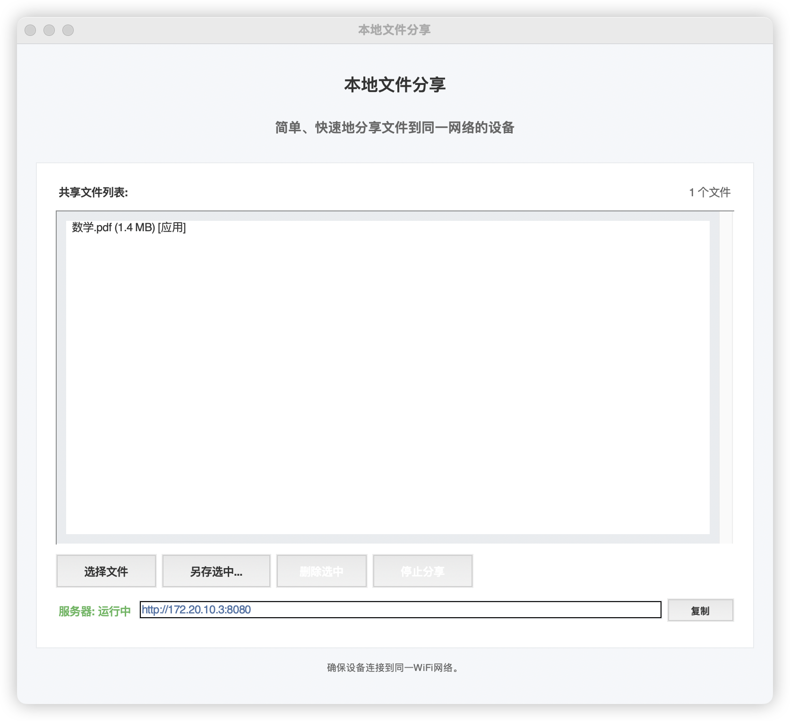
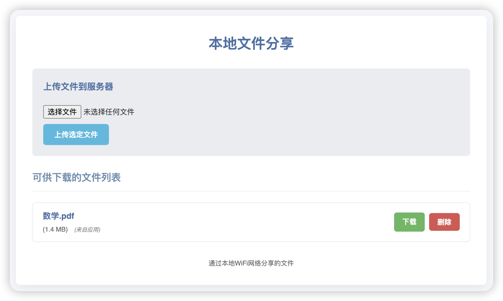
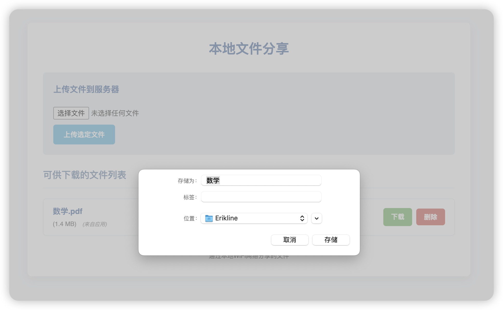
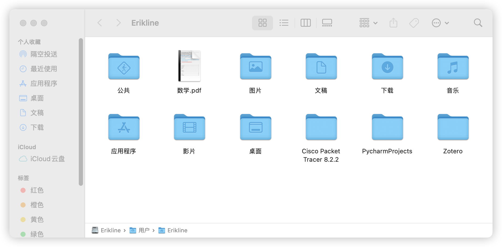

# 📁 Local File Sharing Application

This is a simple Python application built with Tkinter for the GUI and uses `http.server` as the web server.  
It allows you to easily share local files over the same LAN (WiFi or Ethernet) through a web browser.

---

## ✨ Features

- 🖼️ **GUI Interface:** Simple and intuitive Tkinter window to easily start/stop the server  
- 📤 **File Sharing:** Share files you select through the GUI  
- 🌐 **Web Upload:** Upload files directly to the server from the browser  
- 📥 **Web Download:** Access and download shared files via the browser  
- ❌ **Web Delete:** One-click file deletion from the browser  
- 🔍 **Auto IP Detection:** Automatically displays your local network access address  
- 🎨 **Modern Style:** Clean and beautiful web frontend interface

---

## 🧰 Requirements

- 🐍 Python 3.6 or higher  
- 🧱 Tkinter (comes pre-installed with Python)

---

## 🚀 Installation Steps

1. 📥 Clone or download this repository  
2. 📂 Open a terminal and navigate to the project directory:

    ```bash
    cd /path/to/your/project
    ```

3. ▶️ Run the main script:

    ```bash
    python main.py
    ```

---

## 🧑‍💻 Usage

1. Run `main.py` to start the application  
2. A Tkinter GUI window will pop up  
3. Click **“Select File”** to add files you want to share  
4. Click **“Start Sharing”** to launch the HTTP server  
5. The program will display the access URL (e.g. `http://192.168.1.100:8000`)  
6. Enter this address in any device browser on the same LAN  
7. 🌐 Browse shared files, click to download, or use buttons to upload/delete files  
8. Click **“Stop Sharing”** to shut down the server

---

## 🗃️ Project Versions

There are two main versions of this project:

1. 🧾 **Non-MVC version (`1st-NON/`)**  
   > All logic is in a single script for easy understanding and quick start

2. 🧱 **MVC version (`2th-MVC/`)**  
   > Follows the Model-View-Controller architecture for clear structure and easier maintenance

---

## 📁 Project Structure

````
root
├── 1st-NON/
│   ├── main.py
│   └── uploads/
├── 2th-MVC/
│   ├── app\_controller.py
│   ├── app\_view\.py
│   ├── config.py
│   ├── file\_model.py
│   ├── http\_handler.py
│   ├── ip\_utils.py
│   ├── main.py
│   ├── styles.py
│   └── uploads/
├── README.md
└── README\_en.md

````

---

## ⚙️ Configuration

- 📂 The upload directory is set to `uploads/` by default  
- To modify, edit `config.py`:

    ```python
    UPLOAD_FOLDER = "uploads"
    ```

---

## 🙌 Contribution

Feel free to 🙌 fork this project and submit pull requests  
Issues and suggestions are also welcome 🐛

---

## 📄 License

This project is licensed under the **MIT License**.  
See the `LICENSE` file in the root directory for details.

---

## 🖼️ Screenshots

> Below are screenshots of the local file sharing app’s GUI and web file management interfaces:

### 🎛️ GUI Interface (Tkinter)


---

### 🌐 Web Interface (File List + Upload/Delete)


---

### 📸 System Interface Display

#### 🖥️ User One Upload Interface (Local GUI)

> User one selects files via the local graphical interface and starts the sharing service.



---

#### 🌐 User Two Browses File List (Browser)

> User two visits the sharing link via browser and views the available files.



---

#### 📥 User Two Downloading File

> User two clicks a file to download, triggering the browser’s download prompt.



---

#### ✅ User Two Download Successful

> The file is successfully saved to user two’s local device.



---
